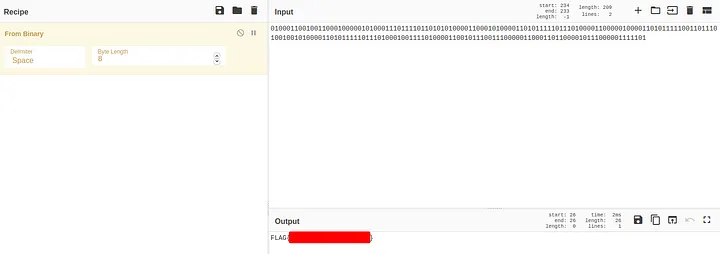
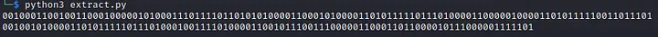

# Data Exfiltration Challenge — CTF Internacional MetaRed 2021 - 3rd STAGE


    Last night mr. heker broke into our systems and stole our flag. All our communications are secure and we can’t tell how the data leave our network.

    I will send you an abnormal trace of communication. Please analize it and let me know if you figure it out. We need to get back that flag.

    By the way. You know how mr. heker loves to play with people’s mind. He delivered a video with a creepy toy repeating the words “tic toc, tic toc”. I am not sure if it is a clue or just a silly game of him.

    Creator : Nandx

Points to note :
* The PCAP File contains 418 ICMP Packets.
* ICMP : Internet Control Message Protocol
* The Hint the attacker left behind is a creepy toy that kept repeating **tic toc,tic toc **

**The tic-toc part diverts the focus to the time of request.**

Why Request? : Data is being exfiltrated here using the ICMP Protocol, so the replies can be disregarded.

1. The attacker can control the time difference between the one packet and another.
Therefore,

```
View → Time display format → Seconds since previous captured packet and also change the format to only seconds.
```

2. To see only the requests, apply the display filter

```
icmp.type == 8
```


3. Export the packet dissections.

```
File → Export Packet Dissections → As CSV
```

4. I have used pandas to extract only the time field data, you may use a tool of your choice or just continue with the pandas method. On running the python file you should get a string of bits.




**Why disregard the leading 0, (Notice that I have popped the first element from the pktimes list, in the python program. If I did not, I would have had a 0 there)**

When I took the output without removing the leading 0, I got,



Convert it to ASCII to find the flag.


There was one extra 1 in the end. So, I decided to remove the first 0, since that is the time related to the first packet in the capture and the attacker would not have been able to manipulate it (It will remain 0.00000).

Happy Hunting…