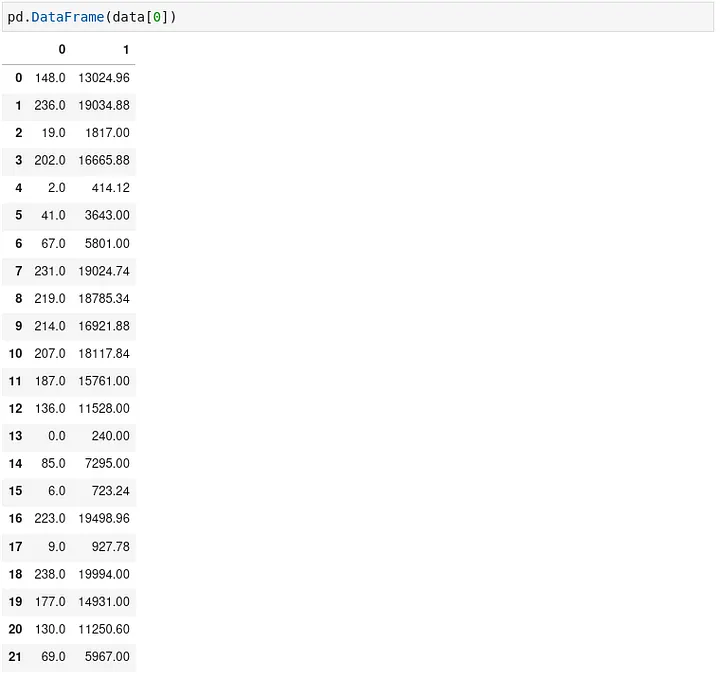
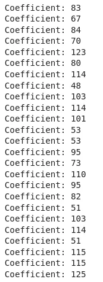

# SSTF 2021 — meLorean Challenge

There was a crazy Data Scientist who rectilinearly claimed mathematics can make miracles. He left a note and then disappeared. Help to decode it.

There seems to have been problem that was related to something linear in the SCTF 2021 meLorean Challenge.

As a person who works with data on a day to day basis, I related to the dataset in terms of Linear Regression almost immediately.

I thought of each letter as a dataset and when I plotted the coordinates on each list as their own graph, I got lines.


So, I thought, why not fit all such lines into a linear regression model and find out their coefficients.

I got this idea by randomly examining 2 coordinates of numbers in the first list.

```

(67,5801) and (0,240)

f(0) = 240 (Inference (If f is a linear equation) is that Bias = 240)

f(67) = 5801

```

`5801 – 240 = 5561`, which is also `67 * 83`, so I stumbled upon the value of the coefficient of this line, but the other coordinates in the same list did not match.

There was some level of deviation from the line, which is also clearly visible on figure 1.

So, rounding off is necessary.

I created a data frame in pandas for each list of coordinates.

Press enter or click to view image in full size



I fit these data frames on a model of
their own and got the model’s coefficients.


All I had to do was round them off now and convert to ASCII.



Replacing the ASCII Characters we get the flag.

Here’s my code:

