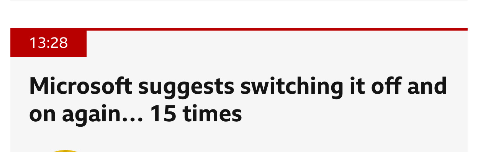

# Crowdstrike Falcon Content Update for Windows Hosts
    when the world shut down for maintenance!!
---

# Introduction
 
The disruption began on a Friday morning in Australia, and soon, woke up IT teams all across the world. The outage has affected several companies including, payment systems, healthcare systems, airline and railway industries. It is reported that 911 emergency services are down in the US for several states, and NHS in the UK, are also facing outages. 

**George Kurtz**, the **CEO of Crowdstrike**, has posted on X,

    "We understand the gravity of the situation and are deeply sorry for the inconvenience and disruption. We are working with all impacted customers to ensure that systems are back up and they can deliver the services their customers are counting on"

    "CrowdStrike is actively working with customers impacted by a defect found in a single content update for Windows hosts. Mac and Linux hosts are not impacted. This is not a security incident or cyberattack. The issue has been identified, isolated and a fix has been deployed. We refer customers to the support portal for the latest updates and will continue to provide complete and continuous updates on our website. We further recommend organizations ensure they’re communicating with CrowdStrike representatives through official channels. Our team is fully mobilized to ensure the security and stability of CrowdStrike customers."


On the **19th on July, 0409 UTC**, Crowdstrike released a content update, for the Falcon agent. They quickly reverted the changes, and as a result **hosts that booted up after 0527 UTC shouldn't experience any issues**. **Only windows hosts that were equipped with the crowdstrike falcon agent were affected** and Mac and Linux users are safe. According to Crowdstrike, **Windows 7/2008R2 were not affected** by this issue.

The bug caused the windows host, to go into BSOD, the famous **Blue Screen of Death**, and get stuck in a restart state. The following consumer complaint will help you understand the weight of the situation.

```
jmcgough - ycombinator

Took down our entire emergency department as we were treating a heart attack. 911 down for our state too. Nowhere for people to be diverted to because the other nearby 
hospitals are down. Hard to imagine how many millions if not billions of dollars this one bad update caused.
```


# Cause of the outage

The Crowdstrike Falcon sensor, is an endpoint security component, which is designed to protect devices from malicious actors. While the WindowsBootLoader, loads the OS Kernel into memory, it also loads critical components like the Falcon Sensor, which is a LKM ([Loadable Kernel Module](https://en.wikipedia.org/wiki/Loadable_kernel_module)). If this module errors out, it causes a failure in the boot sequence, causing the system to crash. Systems that were not running Falcon Sensor, were not affected.

<p align="center">  </p>


The Falcon Sensor, receives configuration updates, multiple times in a day as a part of the Crowdstrike's defensive operations. One such configuration update, was what caused the issue. The config update triggered an error, causing a failure in the boot sequence, resulting in the BSOD screen. In this case turning it off and on again wouldn't work!!

<p align="center">  </p>

When a computer is live (turned on), Falcon sensor driver pulls updates from the CS cloud. If this happened between 04:09 UTC to 05:27 UTC on July 19th. Then, that host, would not be able to boot properly due to a bad config update for the falcon sensor.

<p align="center">  </p>

The config files referred to as "Channel Files" reside in `C:\Windows\System32\drivers\CrowdStrike\` and they are used by falcon, to protect the host when its offline (when its not able to contact the crowdstrike cloud). The botched config file or "channel" file in this case starts with `C-00000291-` and has a `.sys` extension. Which is why, the initial remedy was to delete this file. After all, if a config is not there, it wont be applied right. 

So, if you are facing this problem, the last updated timestamp of this file. `C:\Windows\System32\drivers\CrowdStrike\C-00000291-*.sys`, is probably after 04:09 UTC. The version of the file before 04:09UTC is in a good state. If you are on Windows, you can use the following steps to recover:

- Boot into Safe Mode 
- Open command prompt

- Run the following commands one by one.

```
CD C:\Windows\System32\drivers\CrowdStrike

dir C-00000291*.sys

del C-00000291*.sys
```

- Restart your device

Systems running MacOS and Linux, do not use Channel File 291, and hence, were not affected by the bad update. 

## Channel File 291 - Deep Dive

Named pipes are a method for interprocess communication (IPC) used by Windows systems. They allow processes to communicate with each other, either on the same machine or over a network. Named pipes can be used for legitimate purposes, such as data sharing between applications, but they can also be exploited by malware for malicious activities.

CF-291, controls how Falcon evaluates a pipe execution on Windows. The update was published as response to a newly observed malicious C2 framework, that used malicious named pipes in their attack.

# Conclusion

Experts estimate the damage from the global Microsoft outage at billions of dollars, with significant impacts on various sectors. Many Hospitals were also shutdown, hindering emergency services, which might have caused some damage to human lives. The airline industry was severely affected, resulting in thousands of flight cancellations and operational suspensions by major US carriers such as United Airlines, Delta Air Lines, and American Airlines. The London Stock Exchange halted trading, and a third of McDonald's restaurants in Japan closed due to malfunctioning cash registers. 

Crowdstrike stocks fell by nearly 10% in 2 days. Economists suggest that the company will not be able to survive the financial storms its going to face, from the lawsuits that follow.

<p align="center">  </p>

All this could have been avoided, if only Crowdstrike tested their code in a staging environment, understanding the criticality of the software they are running. This whole episode has only re-established the need for proper testing of software, before ramming it on production. It also raises a few questions on why we let one seemingly not so popular organization take down the entire world.