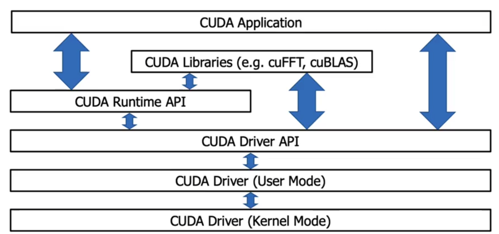
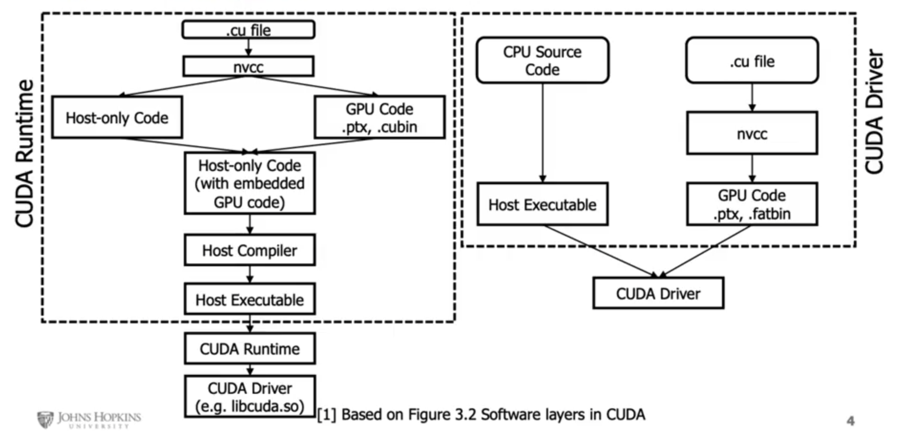

# Introduction to Concurrent Programming with GPUs

## What is Concurrent Programming?

* Modern programming is built around maximizing utilization of multiple cores and processors of modern computers. We do that by running multiple processes and threads. Used when software requires high computation requirements - Signal Processing, AI, etc. OS schedules threads, but correctness (sync, atomicity, memory ordering) is on the developer.
* Thread: An independant collection of sequentially executed programming steps.
* Modern computers have 4-8 cores and 4-16 active threads.
* Scheduler is at the heart of any OS's multithreading capability.
* Memory caches are hierarchical in nature, works on the principle that memory thats physically closer is more performant, used to reduce time waste accessing main memory / disk.

## Concurrent Programming Pitfalls

* Race Conditions: When threads execute in a sequence, which is different than intended, The expercted order of operations is not followed and issues arise. Point to note is that, the threads execute their instructions properly and to completion based on the state of the shared variable. Minimize the use of shared/global variables. You can also use atomic variables with mutual exclusion and memory visibility/order (memory model). 
    
    ```
    A race is when outcome depends on timing/interleaving. The bug is often a data race (unsynchronized conflicting accesses), but races can exist even without shared variables (e.g., check-then-act on external state).
    ```

* Resource Contention: Two or more threads attempt to access/modify the same memory and conflict. It can happen between any two computing systems (threads, processes or even different computers). Contention can just slow you down; race corrupts correctness. 
    
    ```
    Resource contention exists because multiple threads compete for the same lock, but no race condition occurs because the lock enforces mutual exclusion, ensuring only one thread enters the critical section at a time, creating a clear happens-before relationship.
    ```

* Dead Lock: One or more processes are blocked from making progress while waiting for a resource, while **not** relinquishing their hold on a shared resource. This behaviour causes multiple threads to become blocked on each other, eventually ending up in a halted stae.

    ```
    The Coffman conditions, named after Edward G. Coffman, Jr., who first outlined them in 1971, describe four necessary conditions that must be present simultaneously for a deadlock to occur: 
    - Mutual Exclusion 
    - Hold and Wait 
    - No Preemption 
    - Circular Wait 
    ```

* Live Lock: Like dead lock but the processes are actively running, can happen when a programming loop tests for access prior to making a final change. This can end up in a non-halting state, recursively executing same code or even a buffer or stack overflow.

    > Even though both result in no useful progress, programs in deadlock stop running or exeuting any steps, so its easier to detect. But programs under a live lock, often execute the same thing repeatedly giving us the assumption that they are doing something. Livelock often shows high CPU usage with zero throughput, which misleads monitoring.

* Resource Over / Under Utilization: Too little work, CPUs are sitting idle (wastage). Too many threads, CPUs are spending too much time context switching. Processes are overly complex and CPU heavy. Memory required is too large and changes very frequently. This means cache misses and data is transported too and from RAM/Disk too often, causing unnecessary latency.

## Concurrent Programming Problems and Algorithms (patterns to look for)

* Dining Philosophers: Philosophers in a round table. Each has a fork on the left and right (shared variables). They need 2 forks to eat, they can only pick up on fork at a time / eat / put one fork down at a time. We need an algorithm that allows all philoshophers to eat, while avoiding deadlock & starvation. An algorithm can avoid deadlock yet still allow some philosophers to be perpetually delayed if access to forks is not fair.

* Producer Consumer: Very common in message queue patterns. One or more producers add data to a buffer, that is then consumed by consumers. 

* Sleeping Barber: N customers can sit in the waiting room, and there is only 1 barber. When inactive a barber sleeps. If a barber is sleeping a customer should wake him up and waits. If there is no space in the waiting room, no new customers can be added to the waiting room.

* Data and Code Synchronization: Synchronization locks to control access to data and code in many languages. Implementation of locks can be mangaged like a deli counter ticketing systems. Semaphores are means of showing state, that can be used manage use of sections of code or data. Through locks, semaphores, and algorithms partial solutions can be devised to handle many concurrent programming issues, though there will always be competing constraints of access and efficiency.

## Concurrent Programing Patterns

* Divide and Conquer: Take large datasets and divide it. Small solve problems and apply those soltions to solve larger problems. Implementation is easy and powerful on computing platforms that can maintaing complex state.

* Map Reduce: Its a subset of the DnC pattern, each mapper takes a single input and returns one value, and a reducer takes multiple values and reduces it into one value. There needs to be more mappers than reducers.

    To check if a number is in a set, each mapper checks if the value passed to it is equal to the number we are searching for, if  it is equal return 1 else 0. A reducer takes all these return values and decides whether the number was in the set or not.

* Repository: A Central Repository manages central state across multiple running processes. It maintains the state of the shared data and manage access to it. It also updates and manages this data through predefined communication mechanisms. The processes need to interact with the repository for accessing this data, and maintain their own state, and must synchronize computation on the repository amongst themselves. Repositories **do not** control the order in which processes do computation.

* Pipelines/Workflows: Pipelines can manage multiple sysnchronous or asynchronous processing steps in a linear fashion. Each step can have its own logic. Workflows are pipelines with more complex interactions, and can be represented as a DAG (Directed Acyclic Graph). (But some systems allow cycles)

* Recursion: Data is divided into head and tail, functions operate of the head data and call themselves with the tail data. Recursion requires management of state, and they must have a final state. It is not advisable, since its too complex and GPUs do not perform well on this pattern. CUDA supports recursion (with limits); it’s often avoided due to stack/overhead/divergence.

## Integrated vs Dedicated GPUs

* Integrated GPUs: They are built into the CPU and share system memory. They use less power and generate less heat, because of this, they can help with battery life and are common in consumer latops.

* Dedicated GPUs: They are seperate from the CPU and do not share memory. They use more power and generate more heat. They are more commonly used in desktops. Nvidia has a seperate programming framework to take more specific control of GPU hardware (CUDA), this is not possible in AMD based dedicated GPUs. OpenCL is one of the most common opensource heterogenous computing platforms with support for most CPU and GPU hardware. OpenAcc is newer framework for making it easier to use numerous types of accelerators, including CPUs and GPUs. It aims to use decorators for accelerating code, and offers lesser control. CUDA is the leading framework for developing code that executes on Nvidia GPUs. It controls both high-level and low-level access and memory capabilities.

## Nvidia GPU Architectures

* Tesla: Allowed CUDA programming
* Fermi: Introduced FP64 floating point values
* Kepler: Introduced Dynamic Parallelism => improved programmability
* Maxwell: Higher Perf/Watt (more cores, more memory bandwidth, and lower power consumption)
* Pascal: Unified Memory, Stacked DRAM, NVLINK (makes memory transfers faster)
* Turing: Introduced Ray Tracing and Tensor Cores
* Ampere: More Faster, More Memory  (more tensor and raytracing cores)

## CUDA Software Layers



* The CUDA application can communicate with either the runtime or the driver APIs. The decision is upto the developer and it is a deciding factor in showing what the underlying software will look like and how it will be compiled.



#### Higher level Access Pattern (Runtime API)

The CUDA Runtime API was developed by NVIDIA as a simpler option that the Driver API. It is an abstraction of the Driver API. In the Runtime API, all kernels that were compiled into any GPU code are available to host code. The code that utilizes this API is written in C++. 


* Runtime API hides context creation, Device selection, Module loading / kernel symbol management. You lose control over:
    * When and how contexts are created. 
    * You can’t dynamically load/unload PTX modules with the same flexibility
    * You’re constrained to the runtime’s lifecycle and abstraction decisions

* Embed GPU code in host code and compile everything with *nvcc*.
* *nvcc* compiles device code, embeds it into the host binary, and generates host-only code.
* The host compiler produces an executable that interacts with the CUDA Runtime, which automatically loads and launches kernels.

```
nvcc -o vector_add vector_add.cu

./vector_add
```

#### Lower level Access (Driver API)

Developed by NVIDIA to offer more fine grained control of what is executed on hardware. Language independent , so any base that can invoke cubin objects will be able to use this API. The driver API needs to be initialized atleast once via the **cuInit** function.

* Compile the GPU and CPU code seperately and have the host executable interact with the GPU code interactively.
* The CUDA kernel (.cu) is compiled by itself into PTX or a fatbin. This produces GPU-only code, not an executable.
* The host program (drivertest.cpp) is compiled separately into an object file. It contains Driver API calls, not kernels.
* The object file is linked into an executable that links against libcuda. This creates a normal CPU program.

At runtime, the executable:

* Initializes the CUDA driver
* Loads the PTX/fatbin file - The file (PTX/fatbin) is loaded as a module.The kernel function is retrieved from the module.
* Extracts the kernel symbol
* Launches the kernel manually

```
nvcc -o matSumKernel.fatbin -fatbin matSumKernel.cu -lcuda (or) nvcc -o matSumKernel.ptx -ptx matSumKernel.cu -lcuda

nvcc -o drivertest.o -c drivertest.cpp -lcuda

nvcc -o drivertest drivertest.o -lcuda

./drivertest
```

#### Writing CUDA Applications

A CUDA application will be part host based and part GPU targetted code, the code will co-exist in the same file or be seperate. Code files with CUDA will have the .cu or .cuh extensions. Neural network/Mathematical constructs using CUDA are pytorch and tensorflow. 

    A common way to use CUDA is to use NVIDIA CUDA developer toolkit libraries. Some remove the need for complex CUDA code, and make complex data structures or programming constructs simpler. Examples: cuBLAS, cuFFT, NPP, Thrust, etc.

## CUDA Keywords

### Execution Context / Function Qualifiers

* `__device__` - Called from GPU context and executed on GPU

    ```
    It is called from a kernel or another device function
    It runs inside a single thread
    It is just normal logic, not a launch
    ```

* `__global__` - Called from CPU context and executed on GPU

    ```
    It is an entry point from the host
    It is launched with <<<grid, block>>>
    It represents parallel work across many threads
    It does not return a value
    ```

* `__host__` (default)  - Called from CPU context and executed on CPU. Responsible for: Memory allocation, Data movement, Kernel launches, Synchronization, Control flow

    ```
    Only the host (CPU) calls the CUDA Runtime API.

    That includes:

    * cudaMalloc
    * cudaFree
    * cudaMemcpy
    * cudaMemcpyAsync
    * cudaMemset
    * cudaDeviceSynchronize
    * kernel launches (<<< >>>)
    ```

### Threads, Blocks and Grids

```
kernel <<<blocksPerGrid, threadsPerBlock, sizeOfSharedMemory(optional), cudaStream(optional)>>> (kernelArgs)
```

* Threads - Each invocation of a kernel executes on a single thread
* Blocks - Collection of threads that share memory and should be a multiple of 32 (not required, but recommended for better occupancy/efficiency)
* Grids - Collection of blocks that share some memory. Blocks don’t share shared memory; cross-block comm is via global memory (or cooperative groups in special cases).

### Memory Keywords

* `int, char, float, etc` - Based on hardware and number of threads registers will be used.
* `const/__constant__` - const memory keyword, will attempt to allocate based on hardware.
* `shared/__shared__` - Memory that is shared within a block.

## CUDA Project Structure and Best Practices

#### Project Structure
* Flat code with single entry point (main function) and using make/cmake should have the following structure


    ```
    # simple project
    project/
        main.cpp - for code 
        main.h  - for headers
        Makefile (or) CMakeLists.txt - for building the project
        README (or) README.md - documentation etc.
    
    # complex project
    project/
        # for complex cmake config files
        cmake/
        # documentation
        docs/
        # your code
        src/
            # headers thats used by other files
            common/
                utils.h
            main.cpp
            others.cpp
        # for public header files
        include/
            common/
                utils.h
            main.h
            other.h
        # Test code
        tests/
        Makefile (or) CMakeLists.txt
        README (or) README.md

    ```

#### Best Practices

* Strong Scaling: The algorithms are easily parallelizable, and can be measured by Amdahl's Law.
* Weak Scaling: When increasing the number of processes doesn't have a linear effect on performance

Calculate what code / what parts of the code are run on GPUs, the more you parallelize the better.

* Consider memory optimization (though may not have a huge impact on performance)
* Branching like, `if` or `do while` can be costly. (Why? Refer: Warp Divergence)
* Profile your code using `Nsight Systems/Compute`.
* Test your code
* Make performance metrics, part of your code's execution, to compare against sequential or less parallel implementations.


## SAMPLE CUDA CODE

```C++
/*
 * Copyright 1993-2015 NVIDIA Corporation.  All rights reserved.
 *
 * Please refer to the NVIDIA end user license agreement (EULA) associated
 * with this source code for terms and conditions that govern your use of
 * this software. Any use, reproduction, disclosure, or distribution of
 * this software and related documentation outside the terms of the EULA
 * is strictly prohibited.
 *
 */

/*
 * Vector multiplication: C = A * B.
 *
 * This sample is a very basic sample that implements element by element
 * vector multiplication. It is based on the sample illustrating Chapter 2
 * of the programming guide with some additions like error checking.
 */

#include "simple.h"

/*
 * CUDA Kernel Device code
 *
 * Computes the vector product of A and B into C. The 3 vectors have the same
 * number of elements numElements.
 */
__global__ void vectorMult(const float *A, const float *B, float *C, int numElements)
{
    int i = blockDim.x * blockIdx.x + threadIdx.x;

    if (i < numElements)
    {
        C[i] = deviceMultiply(A[i], B[i]);
    }
}

__device__ float deviceMultiply(float a, float b)
{
    return a * b;
}

__host__ std::tuple<float *, float *, float *> allocateHostMemory(int numElements)
{
    size_t size = numElements * sizeof(float);

    // Allocate the host input vector A
    float *h_A = (float *)malloc(size);

    // Allocate the host input vector B
    float *h_B = (float *)malloc(size);

    // Allocate the host output vector C
    float *h_C = (float *)malloc(size);

    // Verify that allocations succeeded
    if (h_A == NULL || h_B == NULL || h_C == NULL)
    {
        fprintf(stderr, "Failed to allocate host vectors!\n");
        exit(EXIT_FAILURE);
    }

    // Initialize the host input vectors
    for (int i = 0; i < numElements; ++i)
    {
        h_A[i] = rand()/(float)RAND_MAX;
        h_B[i] = rand()/(float)RAND_MAX;
    }

    return {h_A, h_B, h_C};
}

__host__ std::tuple<float *, float *, float *> allocateDeviceMemory(int numElements)
{
    // Allocate the device input vector A
    float *d_A = NULL;
    size_t size = numElements * sizeof(float);
    cudaError_t err = cudaMalloc(&d_A, size);
    if (err != cudaSuccess)
    {
        fprintf(stderr, "Failed to allocate device vector A (error code %s)!\n", cudaGetErrorString(err));
        exit(EXIT_FAILURE);
    }

    // Allocate the device input vector B
    float *d_B = NULL;
    err = cudaMalloc(&d_B, size);
    if (err != cudaSuccess)
    {
        fprintf(stderr, "Failed to allocate device vector B (error code %s)!\n", cudaGetErrorString(err));
        exit(EXIT_FAILURE);
    }

    // Allocate the device output vector C
    float *d_C = NULL;
    err = cudaMalloc(&d_C, size);
    if (err != cudaSuccess)
    {
        fprintf(stderr, "Failed to allocate device vector C (error code %s)!\n", cudaGetErrorString(err));
        exit(EXIT_FAILURE);
    }
    return {d_A, d_B, d_C};
}

__host__ void copyFromHostToDevice(float *h_A, float *h_B, float *d_A, float *d_B, int numElements)
{
    size_t size = numElements * sizeof(float);
    // Copy the host input vectors A and B in host memory to the device input vectors in device memory
    printf("Copy input data from the host memory to the CUDA device\n");
    cudaError_t err = cudaMemcpy(d_A, h_A, size, cudaMemcpyHostToDevice);
    if (err != cudaSuccess)
    {
        fprintf(stderr, "Failed to copy vector A from host to device (error code %s)!\n", cudaGetErrorString(err));
        exit(EXIT_FAILURE);
    }

    err = cudaMemcpy(d_B, h_B, size, cudaMemcpyHostToDevice);
    if (err != cudaSuccess)
    {
        fprintf(stderr, "Failed to copy vector B from host to device (error code %s)!\n", cudaGetErrorString(err));
        exit(EXIT_FAILURE);
    }
}

__host__ void executeKernel(float *d_A, float *d_B, float *d_C, int numElements)
{
    // Launch the Vector Add CUDA Kernel
    int threadsPerBlock = 256;
    int blocksPerGrid =(numElements + threadsPerBlock - 1) / threadsPerBlock;
    printf("CUDA kernel launch with %d blocks of %d threads\n", blocksPerGrid, threadsPerBlock);

    // REPLACE x, y, z with a, b, and c variables for memory on the GPU
    vectorMult<<<blocksPerGrid, threadsPerBlock>>>(d_A, d_B, d_C, numElements);
    cudaError_t err = cudaGetLastError();

    if (err != cudaSuccess)
    {
        fprintf(stderr, "Failed to launch vectorAdd kernel (error code %s)!\n", cudaGetErrorString(err));
        exit(EXIT_FAILURE);
    }
}

__host__ void copyFromDeviceToHost(float *d_C, float *h_C, int numElements)
{
    size_t size = numElements * sizeof(float);
    // Copy the device result vector in device memory to the host result vector
    // in host memory.
    printf("Copy output data from the CUDA device to the host memory\n");
    cudaError_t err = cudaMemcpy(h_C, d_C, size, cudaMemcpyDeviceToHost);

    if (err != cudaSuccess)
    {
        fprintf(stderr, "Failed to copy vector C from device to host (error code %s)!\n", cudaGetErrorString(err));
        exit(EXIT_FAILURE);
    }
}

// Free device global memory
__host__ void deallocateMemory(float *h_A, float *h_B, float *h_C, float *d_A, float *d_B, float *d_C)
{
    // Error code to check return values for CUDA calls
    cudaError_t err = cudaFree(d_A);
    if (err != cudaSuccess)
    {
        fprintf(stderr, "Failed to free device vector A (error code %s)!\n", cudaGetErrorString(err));
        exit(EXIT_FAILURE);
    }

    err = cudaFree(d_B);
    if (err != cudaSuccess)
    {
        fprintf(stderr, "Failed to free device vector B (error code %s)!\n", cudaGetErrorString(err));
        exit(EXIT_FAILURE);
    }

    err = cudaFree(d_C);
    if (err != cudaSuccess)
    {
        fprintf(stderr, "Failed to free device vector C (error code %s)!\n", cudaGetErrorString(err));
        exit(EXIT_FAILURE);
    }

    // Free host memory
    free(h_A);
    free(h_B);
    free(h_C);
}

// Reset the device and exit
__host__ void cleanUpDevice()
{
    // cudaDeviceReset causes the driver to clean up all state. While
    // not mandatory in normal operation, it is good practice.  It is also
    // needed to ensure correct operation when the application is being
    // profiled. Calling cudaDeviceReset causes all profile data to be
    // flushed before the application exits
    cudaError_t err = cudaDeviceReset();

    if (err != cudaSuccess)
    {
        fprintf(stderr, "Failed to deinitialize the device! error=%s\n", cudaGetErrorString(err));
        exit(EXIT_FAILURE);
    }
}

__host__ void performTest(float *h_A, float *h_B, float *h_C, int numElements)
{
    // Verify that the result vector is correct
    for (int i = 0; i < numElements; ++i)
    {
        if (fabs((h_A[i] * h_B[i]) - h_C[i]) > 1e-5)
        {
            fprintf(stderr, "Result verification failed at element %d!\n", i);
            exit(EXIT_FAILURE);
        }
    }

    printf("Test PASSED\n");
}

/*
 * Host main routine
 */
int main(void)
{
    int numElements = 50000;
    printf("[Vector multiplication of %d elements]\n", numElements);

    auto[h_A, h_B, h_C] = allocateHostMemory(numElements);
    auto[d_A, d_B, d_C] = allocateDeviceMemory(numElements);
    copyFromHostToDevice(h_A, h_B, d_A, d_B, numElements);

    executeKernel(d_A, d_B, d_C, numElements);

    copyFromDeviceToHost(d_C, h_C, numElements);
    performTest(h_A, h_B, h_C, numElements);
    deallocateMemory(h_A, h_B, h_C, d_A, d_B, d_C);

    cleanUpDevice();
    printf("Done\n");
    return 0;
}
```
